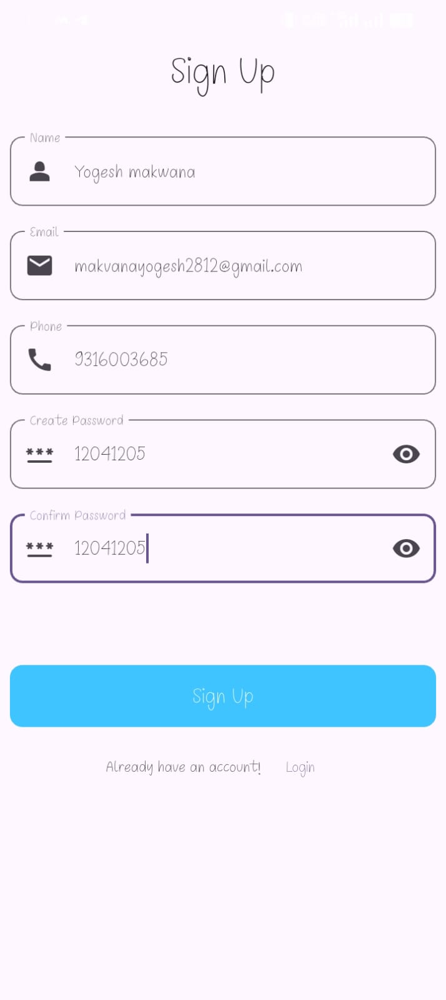
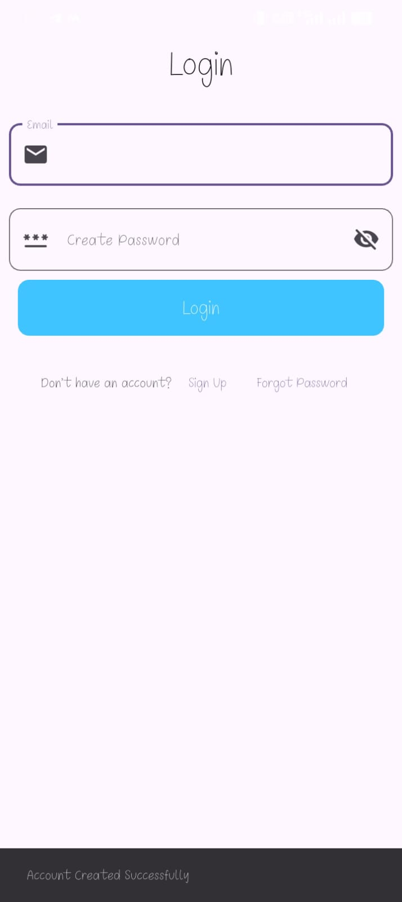
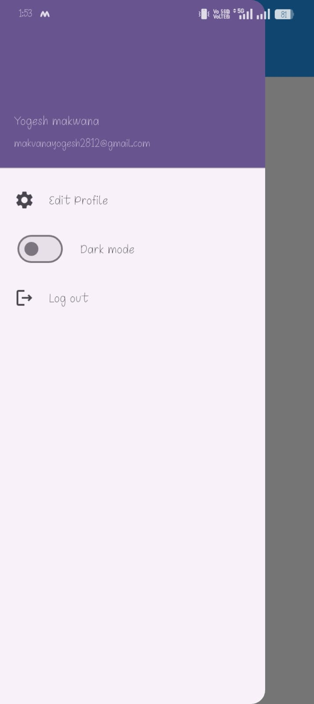
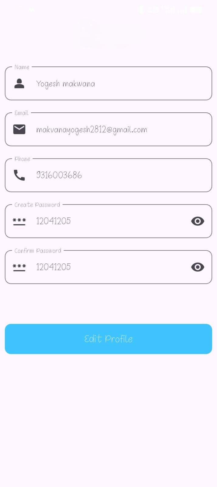

# 🔐 Flutter Authentication App

A complete **Authentication System App** built using **Flutter** with **SharedPreferences** for local data storage. This app includes user authentication features like **Login, Signup, Edit Profile, Forgot Password**, and also supports **Dark/Light Mode**.

---

## 🚀 Features

* 🔑 User Login
* 📝 User Signup (Registration)
* 👤 Edit Profile
* 🔁 Forgot Password (via Email)
* 💾 Local Storage using SharedPreferences
* 🌙 Dark Mode / ☀️ Light Mode toggle
* 📱 Clean and responsive UI

---

## 📸 App Screenshots

<div style="display: flex; flex-wrap: wrap; gap: 10px; justify-content: center;">

  
  
  
  
  

</div>

---

## 🛠️ Tech Stack

* **Flutter**
* **Dart**
* **SharedPreferences**
* Material Design Widgets

---

## 📂 Project Structure

```
lib/
 ├── main.dart
 ├── screens/
 │     ├── login_page.dart
 │     ├── signup_page.dart
 │     ├── home_page.dart
 │     ├── edit_profile.dart
 │     └── forgot_password.dart
 ├── services/
 │     └── shared_pref_service.dart
 └── utils/
       └── theme.dart
```

---

## ⚙️ How It Works

### 🔐 Authentication Flow

1. **Signup**

   * User registers with email & password
   * Data stored locally using SharedPreferences

2. **Login**

   * Credentials are validated from stored data
   * On success → user redirected to Home Screen

3. **Forgot Password**

   * User enters email
   * App checks stored email and allows password reset

4. **Edit Profile**

   * Update user details
   * Changes saved locally

---

## 🌗 Theme Support

* Toggle between **Dark Mode** and **Light Mode**
* Theme preference stored locally

---

## ▶️ Getting Started

### Prerequisites

* Flutter SDK installed
* Android Studio / VS Code

### Run the App

```bash
flutter pub get
flutter run
```

---

## 📌 Future Improvements

* 🔐 Add Firebase Authentication
* ☁️ Cloud database integration (Firestore)
* 📧 Real email verification system
* 🔒 Better password encryption
* 👥 Multiple user support

---

## 🙌 Contribution

Feel free to fork this repository and contribute!

```bash
git clone https://github.com/yogeshgmakvana/authentication-app.git
```

## 👨‍💻 Developer

**Yogesh Makwana**
Flutter Developer 🚀

---

⭐ Don’t forget to **star this repo** if you like it!
